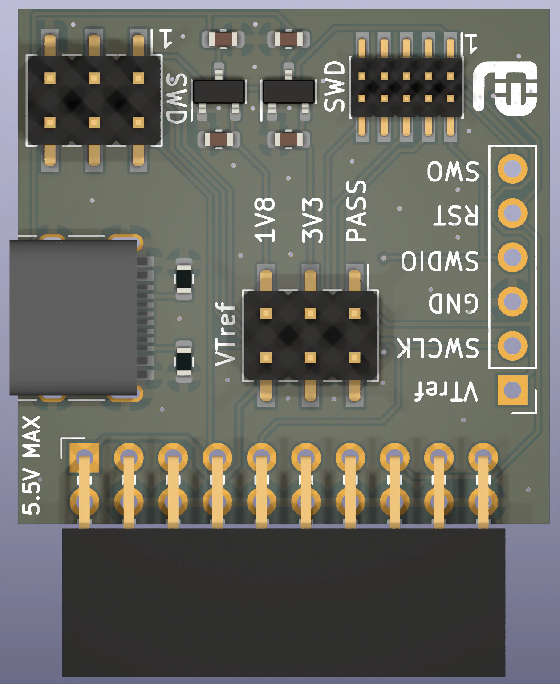
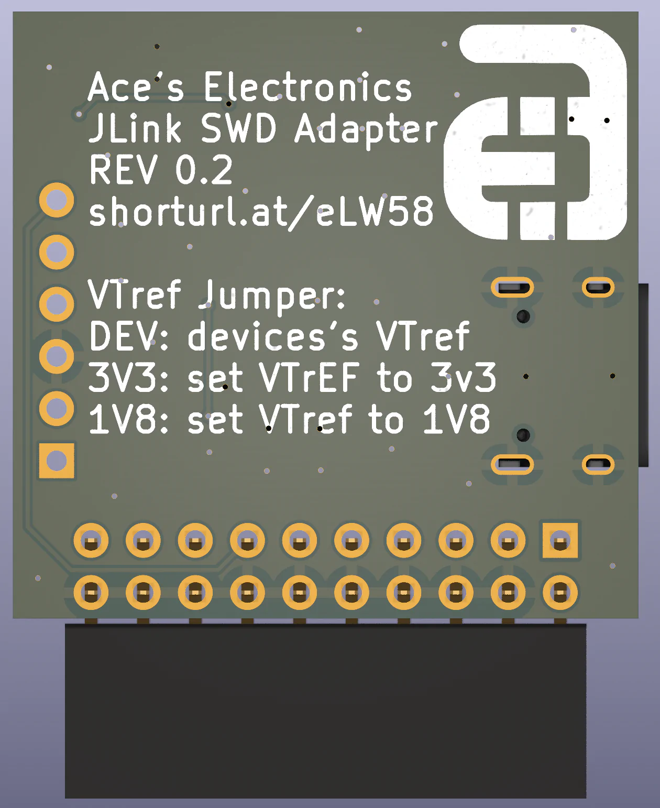

<!--
*** Thanks for checking out the Best-README-Template. If you have a suggestion
*** that would make this better, please fork the repo and create a pull request
*** or simply open an issue with the tag "enhancement".
*** Don't forget to give the project a star!
*** Thanks again! Now go create something AMAZING! :D
-->

<!-- PROJECT SHIELDS -->
<!--
*** I'm using markdown "reference style" links for readability.
*** Reference links are enclosed in brackets [ ] instead of parentheses ( ).
*** See the bottom of this document for the declaration of the reference variables
*** for contributors-url, forks-url, etc. This is an optional, concise syntax you may use.
*** https://www.markdownguide.org/basic-syntax/#reference-style-links
-->
[![Contributors][contributors-shield]][contributors-url]
[![Forks][forks-shield]][forks-url]
[![Stargazers][stars-shield]][stars-url]
[![Issues][issues-shield]][issues-url]
[![MIT License][license-shield]][license-url]

<!-- PROJECT LOGO -->
 

  

  <h3 align="center">JTAG SWD Adapter | 1.27mm and 2.54mm cable connectors</h3>

  

    With selectable 1.8V, 3.3V or passthrough VTref
     
    <a href="https://github.com/84ace/jtag-swd-adapter/issues">Report Bug</a>
    ·
    <a href="https://github.com/84ace/jtag-swd-adapter/issues">Request Feature</a>
  

<!-- TABLE OF CONTENTS -->

  
Table of Contents

  <ol>
    <li>
      <a href="#about-the-project">About The Project</a>
      <ul>
        <li><a href="#built-with">Built With</a></li>
      </ul>
    </li>
    <li>
      <a href="#getting-started">Getting Started</a>
      <ul>
        <li><a href="#prerequisites">Prerequisites</a></li>
        <li><a href="#installation">Installation</a></li>
      </ul>
    </li>
    <li><a href="#usage">Usage</a></li>
    <li><a href="#roadmap">Roadmap</a></li>
    <li><a href="#contributing">Contributing</a></li>
    <li><a href="#license">License</a></li>
    <li><a href="#contact">Contact</a></li>
    <li><a href="#acknowledgments">Acknowledgments</a></li>
  </ol>

<!-- ABOUT THE PROJECT -->
## About The Project

[![JTAG SWD Apadter][product-screenshot]](images/adapter_iso.webp)

This is a simple adapter board that allows you to interconnect various different SWD cables to your 20 pin Jlink or 10 pin Jlink EDU Mini. It also has the ability to set a VTref voltage, should you wind up in a situation where you've accidently wiped certain registers.

Here's why this adapter board exists:
* It's hard to find anything off the shelf that does what this does, and is available to buy
* It's a handy tool to have while doing embedded development

If it's lacking any features please create a ticket.

(<a href="#top">back to top</a>)

### How to buy

Head over to the store

* [Ace's Electronics](https://aceselectronics.store)

(<a href="#top">back to top</a>)

### Built With

You'll need the following to make modifications to the projecy

* [KiCAD](https://www.kicad.org/download/)

(<a href="#top">back to top</a>)

<!-- GETTING STARTED -->
## Getting Started

This is an example of how you may give instructions on setting up your project locally.
To get a local copy up and running follow these simple example steps.

<!-- ROADMAP -->
## Roadmap

- [x] Add support for 20 pin Jlink
- [x] Add support for 10 pin Jlink
- [x] Add configurable VTref

See the [open issues](https://github.com/84ace/jtag-swd-adapter/issues) for a full list of proposed features (and known issues).

(<a href="#top">back to top</a>)

<!-- CONTRIBUTING -->
## Contributing

Contributions are what make the open source community such an amazing place to learn, inspire, and create. Any contributions you make are **greatly appreciated**.

If you have a suggestion that would make this better, please fork the repo and create a pull request. You can also simply open an issue with the tag "enhancement".
Don't forget to give the project a star! Thanks again!

1. Fork the Project
2. Create your Feature Branch (`git checkout -b feature/AmazingFeature`)
3. Commit your Changes (`git commit -m 'Add some AmazingFeature'`)
4. Push to the Branch (`git push origin feature/AmazingFeature`)
5. Open a Pull Request

(<a href="#top">back to top</a>)

<!-- LICENSE -->
## License

Distributed under the MIT License. See `LICENSE.txt` for more information.

(<a href="#top">back to top</a>)

<!-- CONTACT -->
## Contact

Ace's Electronics - [Store](aceselectronics.store)

Acea Quigg - [@aceaquigg](https://twitter.com/aceaquigg)

Project Link: [https://github.com/84ace/jtag-swd-adapter](https://github.com/84ace/jtag-swd-adapter)

(<a href="#top">back to top</a>)

<!-- MARKDOWN LINKS & IMAGES -->
<!-- https://www.markdownguide.org/basic-syntax/#reference-style-links -->
[contributors-shield]: https://img.shields.io/github/contributors/84ace/jtag-swd-adapter.svg?style=for-the-badge
[contributors-url]: https://github.com/84ace/jtag-swd-adapter/graphs/contributors
[forks-shield]: https://img.shields.io/github/forks/84ace/jtag-swd-adapter.svg?style=for-the-badge
[forks-url]: https://github.com/84ace/jtag-swd-adapter/network/members
[stars-shield]: https://img.shields.io/github/stars/84ace/jtag-swd-adapter.svg?style=for-the-badge
[stars-url]: https://github.com/84ace/jtag-swd-adapter/stargazers
[issues-shield]: https://img.shields.io/github/issues/84ace/jtag-swd-adapter.svg?style=for-the-badge
[issues-url]: https://github.com/84ace/jtag-swd-adapter/issues
[license-shield]: https://img.shields.io/github/license/othneildrew/Best-README-Template.svg?style=for-the-badge
[license-url]: https://github.com/84ace/jtag-swd-adapter/blob/master/LICENSE.txt
[product-screenshot]: images/adapter_iso.webp